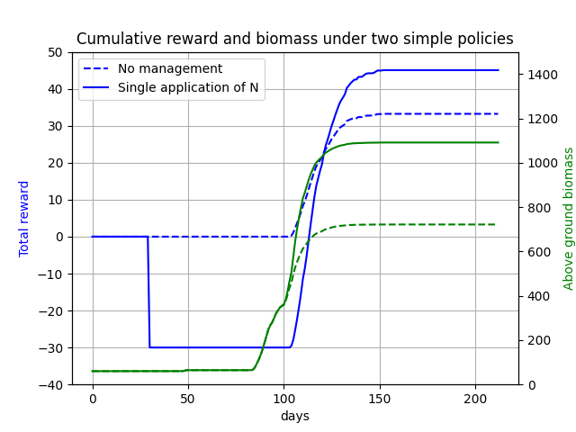

The default implementation of the environment bases its reward purely on eventual yield. For the majority of use cases this is too simplistic. 
The PCSE gym environment has been designed to be easily modifiable to the required complexity. For example, the code below shows how we could extend the PCSE environment to account for fertilizer prices and the costs of its application. 

```python

from pcse_gym.environment.env import PCSEEnv


class CustomPCSEEnv(PCSEEnv):

    def __init__(self, *args, **kwargs):
        super().__init__(*args, **kwargs)

        # N price per unit
        self._n_price = 2
        # Yield price per unit
        self._y_price = 1

        # N application costs
        self._na_price = 10
        # Keep track of how much nitrogen has been applied in the last time step
        self._na = 0

    def _apply_action(self, action):
        super()._apply_action(action)
        # Keep track of the amount of nitrogen that was applied
        self._na = action.get('N', 0)

    def _get_reward(self, *args, **kwargs) -> float:
        # Obtain the default reward, reflecting the increase in yield
        r = super()._get_reward(*args, **kwargs)
        # Balance the yield price with that of the costs of the applied N
        r = r * self._y_price - self._na * self._n_price
        # If N was applied, subtract the application costs
        if self._na != 0:
            r -= self._na_price
        return r
    
```

The environment class retains the functionality of the default PCSEEnvironment class, but has a modified reward function.

```python

from pcse.fileinput import CABOFileReader, YAMLCropDataProvider
from pcse.util import WOFOST80SiteDataProvider

env = CustomPCSEEnv(
    model_config='Wofost80_NWLP_FD.conf',
    agro_config='../pcse_gym/environment/configs/agro/potato_cropcalendar.yaml',
    crop_parameters=YAMLCropDataProvider(force_reload=True),
    site_parameters=WOFOST80SiteDataProvider(WAV=10,  # Initial amount of water in total soil profile [cm]
                                             NAVAILI=10,  # Amount of N available in the pool at initialization of the system [kg/ha]
                                             PAVAILI=50,  # Amount of P available in the pool at initialization of the system [kg/ha]
                                             KAVAILI=100,  # Amount of K available in the pool at initialization of the system [kg/ha]
                                             ),
    soil_parameters=CABOFileReader('../pcse_gym/environment/configs/soil/ec3.CAB'),
)

o = env.reset()

# Define an action that applies N
a = {
    'irrigation': 0,
    'N': 10,
}

o, r, done, info = env.step(a)

print(r)

```

Considering the costs of N and its application, the reward of this time step becomes -30.

The figure below shows the reward progression for simple policies using this model.

